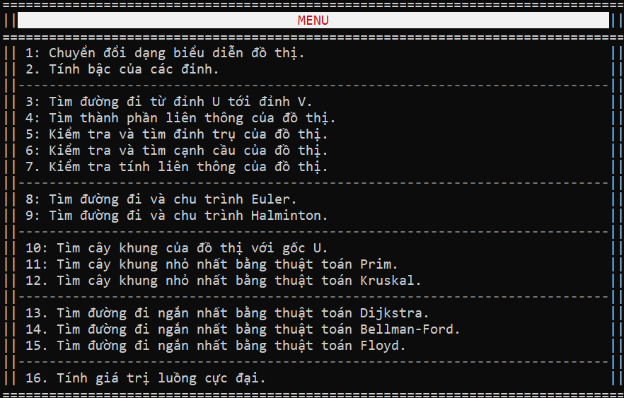

# Basic graph supporter (legacy)
> *Nên "compile and run" để có trải nghiệm tốt hơn.*

Một tool nhỏ sử dụng ngôn ngữ C++ giúp giải các bài tập đồ thị cơ bản.

## Chức năng

Tool xây dựng trong thời gian ngắn và không maintain nên sẽ vẫn còn bug.